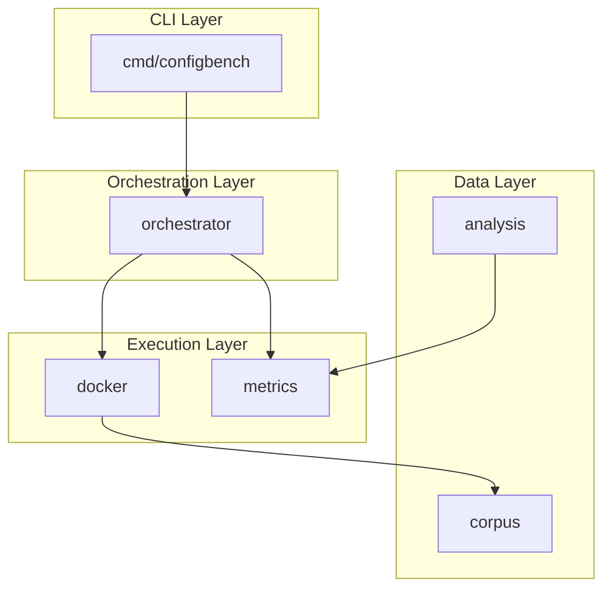
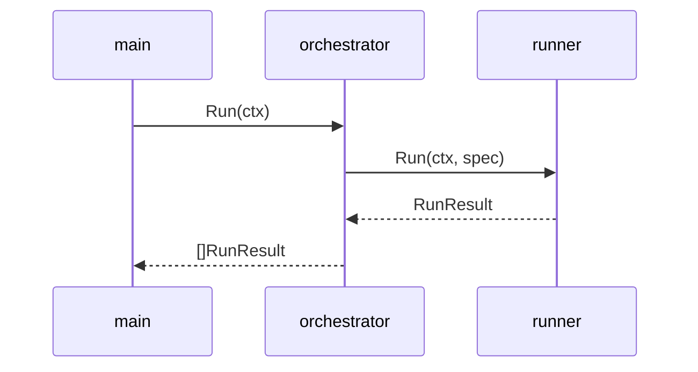
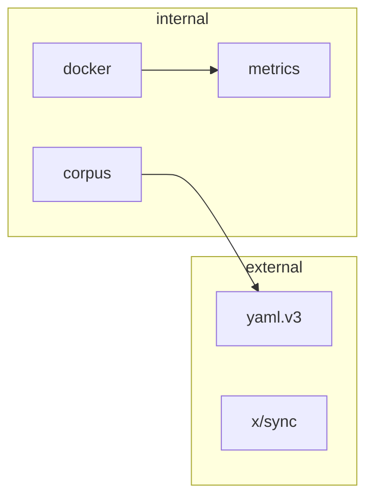
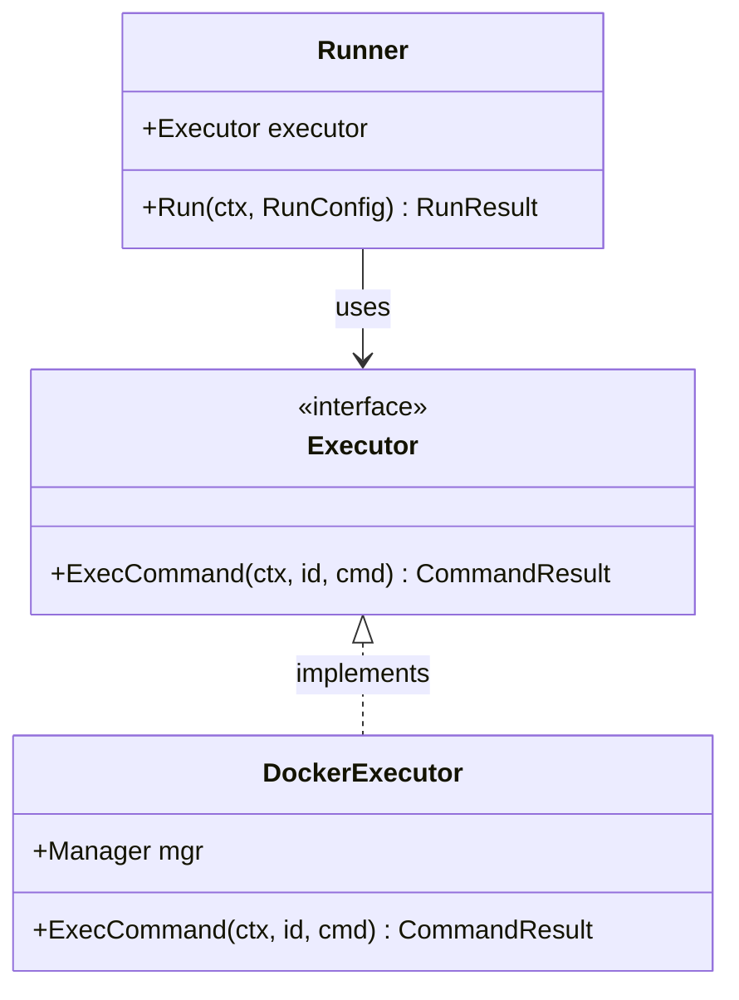

# Generate Documentation Diagrams from Code

Generate accurate, reproducible Mermaid diagrams from Go source code.

## Usage

```
/docs-diagrams-code <diagram-type> <folder>
```

**Diagram types:**
- `arch` - Architecture/layer diagram (package structure)
- `flow` - Sequence diagram (key execution flows)
- `deps` - Dependency graph (imports between packages)
- `types` - Type relationships (structs, interfaces)
- `all` - Generate all applicable diagrams

**Examples:**
```
/docs-diagrams-code arch internal
/docs-diagrams-code types internal/docker
/docs-diagrams-code all .
```

---

## Instructions

Follow this **deterministic extraction process** to ensure reproducible diagrams.

### Phase 1: Structured Code Analysis

Use grep/glob to extract data programmatically. This ensures reproducibility.

#### For `arch` diagrams:

1. Find all Go packages:
```bash
find <folder> -name "*.go" -not -name "*_test.go" | sed 's|/[^/]*$||' | sort -u
```

2. Identify package purposes from `doc.go` or first-line comments
3. Read directory structure to determine layers (cmd, internal, pkg, etc.)
4. Identify cross-package dependencies from import statements

**Data to extract:**
```
packages: [{name, path, layer, dependencies[]}]
```

#### For `flow` diagrams:

1. Find entry points:
```bash
grep -rn "func main\|func Run\|func New\|func Start" --include="*.go" <folder>
```

2. Trace key function call sequences
3. Identify inter-package calls

**Data to extract:**
```
participants: [package_a, package_b]
calls: [{from, to, action, return?}]
```

#### For `deps` diagrams:

1. Find all internal imports:
```bash
grep -rn '".*/<module-path>/internal/' --include="*.go" <folder>
```

2. Find external imports:
```bash
grep -rn '"[a-z].*\..*/' --include="*.go" <folder> | grep -v "/<module-path>/"
```

3. Map import relationships between packages

**Data to extract:**
```
nodes: [package_name]
edges: [{from, to}]
```

#### For `types` diagrams:

1. Find struct definitions:
```bash
grep -rn "^type .* struct {" --include="*.go" <folder>
```

2. Find interface definitions:
```bash
grep -rn "^type .* interface {" --include="*.go" <folder>
```

3. Read struct fields to identify relationships
4. Identify interface implementations (method sets)

**Data to extract:**
```
types: [{name, kind(struct|interface), fields[{type, name}]}]
relationships: [{from, to, relation_type(implements|contains|references)}]
```

### Phase 2: Generate Mermaid Diagram

Use extracted data to generate deterministic diagrams.

#### Architecture Template:


#### Sequence Diagram Template:


#### Dependency Graph Template:


#### Type Diagram Template:


### Phase 3: Output

1. **Create output directory:**
   ```
   <folder>/docs/diagrams/
   ```
   If `<folder>` is `.` or the repo root, use `docs/diagrams/` at the repo root.

2. **Write diagram file** with this format:
   ```markdown
   <!-- Generated by /docs-diagrams-code -->
   <!-- Source: <folder> -->
   <!-- Date: YYYY-MM-DD -->

   # <Diagram Title>

   <Brief description>

   ```mermaid
   <diagram>
   ```

   ## Components

   | Name | Description |
   |------|-------------|
   | ... | ... |

   ## Source Files Analyzed

   - file1.go
   - file2.go
   ```

3. **File naming:**
   - `arch.md` - Architecture diagram
   - `flow.md` - Sequence diagram
   - `deps.md` - Dependency graph
   - `types.md` - Type relationships

### Reproducibility Rules

1. **Sort alphabetically** - all lists of packages, types, files
2. **Match source exactly** - use exact names from code, no paraphrasing
3. **Document sources** - list all files that were analyzed
4. **Deterministic layout** - TB for arch, LR for deps, sequenceDiagram for flows
5. **No assumptions** - only include what's explicitly in the code

### Quality Checks

Before saving, verify:
- [ ] All node names exist in source code
- [ ] All relationships are documented in code (imports, field types, method sets)
- [ ] Mermaid syntax is valid
- [ ] Output path exists or was created
- [ ] Files analyzed are listed

---

## Example Run

For `/docs-diagrams-code types internal/docker`:

1. **Grep for types:**
   ```
   type Executor interface { ... }
   type DockerExecutor struct { ... }
   type MockExecutor struct { ... }
   type Manager struct { ... }
   type Runner struct { ... }
   type RunConfig struct { ... }
   ```

2. **Grep for relationships:**
   ```
   - DockerExecutor has Manager field
   - Runner has Executor field
   - DockerExecutor implements Executor (ExecCommand method)
   - MockExecutor implements Executor (ExecCommand method)
   ```

3. **Generate classDiagram with extracted types and relationships**

4. **Save to:** `internal/docker/docs/diagrams/types.md`
