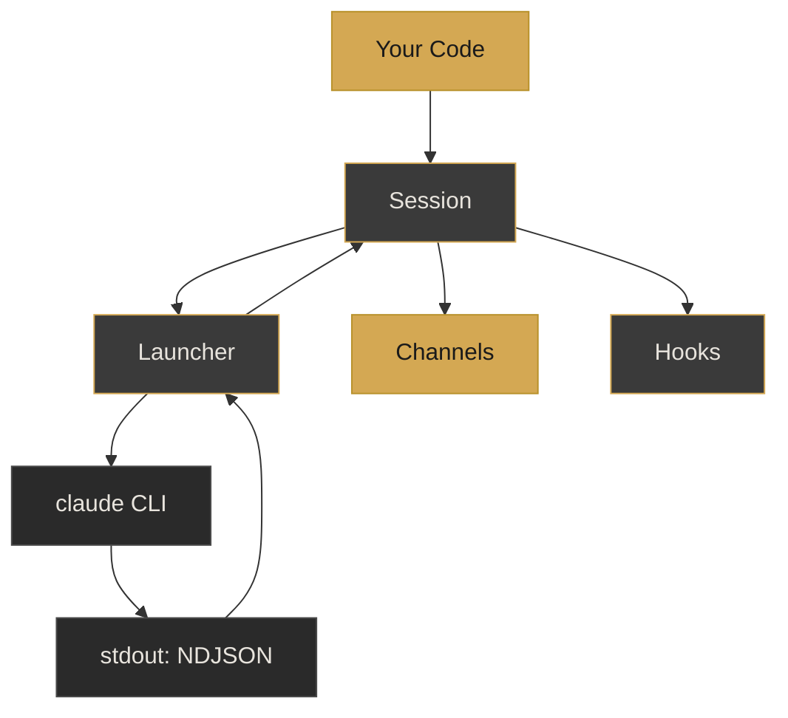
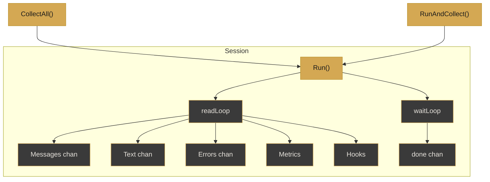
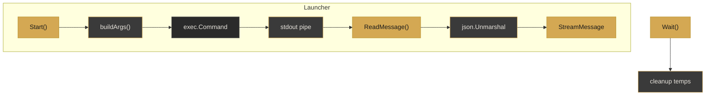
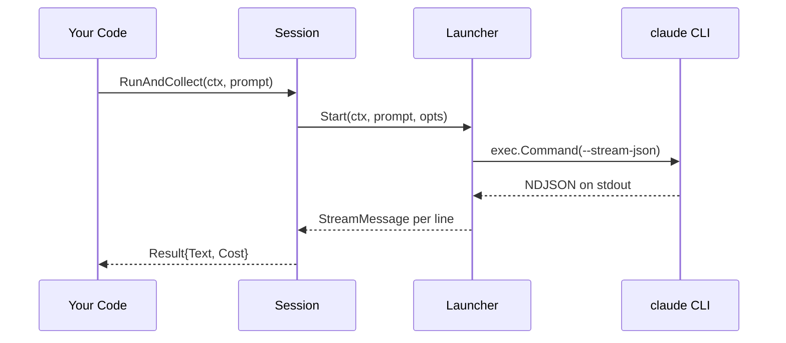

<style>
@import url('https://fonts.googleapis.com/css2?family=Inter:wght@400;600;700&family=JetBrains+Mono:wght@400;500&display=swap');

:root {
  --footer-left: 'Mateo Segura · Jan 2026';
  --footer-right: 'claudesdk-go-v0.2.0';
  --slidev-theme-default-background: #1A1A1A;
  --slidev-theme-default-headingColor: #E8E4DD;
}

.slidev-layout {
  background: #1A1A1A !important;
  color: #E8E4DD !important;
  font-family: 'Inter', system-ui, sans-serif !important;
}

.slidev-layout::before {
  content: var(--footer-left);
  position: fixed; bottom: 1em; left: 2em;
  font-size: 0.65em; color: #4A4A4A; font-family: 'Inter', system-ui;
  letter-spacing: 0.02em; z-index: 100;
}

.slidev-layout::after {
  content: var(--footer-right);
  position: fixed; bottom: 1em; right: 2em;
  font-size: 0.65em; color: #4A4A4A; font-family: 'JetBrains Mono', monospace;
  z-index: 100;
}

h1 { color: #E8E4DD !important; font-weight: 700 !important; }
h2, h3 { color: #D4A853 !important; font-weight: 600 !important; }
p, li { color: #E8E4DD !important; }
strong { color: #D4A853 !important; }
a { color: #D4A853 !important; }
code:not(pre code) { color: #D4A853 !important; background: #2A2A2A !important; padding: 0.15em 0.4em; border-radius: 4px; font-size: 0.9em; }
blockquote { border-left: 3px solid #D4A853 !important; background: #2A2A2A !important; padding: 0.8em 1.2em !important; }
table { border-collapse: collapse; width: 100%; }
th { background: #2A2A2A !important; color: #D4A853 !important; padding: 0.5em 1em; border: 1px solid #3A3A3A; }
td { color: #E8E4DD !important; padding: 0.5em 1em; border: 1px solid #3A3A3A; }
tr:nth-child(even) { background: rgba(42, 42, 42, 0.4); }

pre {
  background: #1E1E1E !important;
  border: 1px solid #333333 !important;
  border-radius: 6px !important;
  font-family: 'JetBrains Mono', 'Fira Code', monospace !important;
  font-size: 0.82em !important;
  padding: 1.2em !important;
  box-shadow: 0 4px 6px rgba(0, 0, 0, 0.4) !important;
}

.shiki-container {
  background: #1E1E1E !important;
  border: 1px solid #333333 !important;
  border-radius: 6px !important;
}

.shiki .line.highlighted {
  background: rgba(212, 168, 83, 0.12) !important;
  border-left: 3px solid #D4A853 !important;
  padding-left: 0.8em !important;
}

.shiki .line::before { color: #4A4A4A !important; }

.mermaid {
  overflow: visible !important;
  display: flex;
  justify-content: center;
  background: transparent !important;
}
.mermaid svg {
  max-width: 95% !important;
  max-height: 440px !important;
  height: auto !important;
}
.mermaid .cluster text { fill: #D4A853; }
.mermaid .edgeLabel { background-color: #1A1A1A; color: #E8E4DD; }

.metric-grid {
  display: grid;
  grid-template-columns: repeat(3, 1fr);
  gap: 1.5em;
  margin-top: 1.5em;
}
.metric-card {
  background: #2A2A2A;
  border: 1px solid #3A3A3A;
  border-radius: 8px;
  padding: 1.2em;
  text-align: center;
}
.metric-value {
  font-size: 2.2em;
  font-weight: 700;
  color: #D4A853;
  font-family: 'JetBrains Mono', monospace;
  line-height: 1.2;
}
.metric-label {
  font-size: 0.75em;
  color: #6B6B6B;
  margin-top: 0.3em;
  text-transform: uppercase;
  letter-spacing: 0.08em;
}
.two-col {
  display: grid;
  grid-template-columns: 1fr 1fr;
  gap: 2em;
  margin-top: 1em;
}
.card {
  background: #2A2A2A;
  border: 1px solid #3A3A3A;
  border-radius: 8px;
  padding: 1.2em;
}
.divider-slide {
  display: flex;
  flex-direction: column;
  align-items: center;
  justify-content: center;
  height: 100%;
}
.divider-act {
  font-size: 0.85em;
  color: #6B6B6B;
  text-transform: uppercase;
  letter-spacing: 0.3em;
  margin-bottom: 0.5em;
}
.divider-title {
  font-size: 2.5em;
  font-weight: 700;
  color: #E8E4DD;
}
.divider-sub {
  font-size: 1em;
  color: #6B6B6B;
  margin-top: 0.5em;
}
</style>

<!--
ACT 1: ORIENT
-->

---

# claudesdk-go

<div style="margin-top: 2em;">
  <p style="font-size: 1.4em; color: #C8C4BD; font-weight: 400;">
    Programmatic Go SDK for the Claude Code CLI
  </p>
</div>

<div style="margin-top: 3em; display: flex; gap: 1em;">
  <span style="background: #2A2A2A; border: 1px solid #D4A853; padding: 0.3em 0.8em; border-radius: 4px; font-family: 'JetBrains Mono', monospace; font-size: 0.85em; color: #D4A853;">v0.2.0</span>
  <span style="background: #2A2A2A; border: 1px solid #3A3A3A; padding: 0.3em 0.8em; border-radius: 4px; font-family: 'JetBrains Mono', monospace; font-size: 0.85em; color: #C8C4BD;">Go 1.24</span>
  <span style="background: #2A2A2A; border: 1px solid #3A3A3A; padding: 0.3em 0.8em; border-radius: 4px; font-family: 'JetBrains Mono', monospace; font-size: 0.85em; color: #C8C4BD;">Zero Dependencies</span>
</div>

---

## Vital Signs

<div class="metric-grid">
  <div class="metric-card">
    <div class="metric-value">2.4K</div>
    <div class="metric-label">Source LOC</div>
  </div>
  <div class="metric-card">
    <div class="metric-value">2.1K</div>
    <div class="metric-label">Test LOC</div>
  </div>
  <div class="metric-card">
    <div class="metric-value">0</div>
    <div class="metric-label">External Deps</div>
  </div>
  <div class="metric-card">
    <div class="metric-value">8</div>
    <div class="metric-label">Source Files</div>
  </div>
  <div class="metric-card">
    <div class="metric-value">45</div>
    <div class="metric-label">Exported Functions</div>
  </div>
  <div class="metric-card">
    <div class="metric-value">30+</div>
    <div class="metric-label">CLI Flags Mapped</div>
  </div>
</div>

---

## Why This Exists

<div class="two-col">
  <div class="card">
    <h3 style="margin-top: 0;">Without This</h3>
    <ul style="list-style: none; padding: 0;">
      <li style="padding: 0.4em 0; border-bottom: 1px solid #3A3A3A;">Manual <code>os/exec</code> plumbing per call</li>
      <li style="padding: 0.4em 0; border-bottom: 1px solid #3A3A3A;">Parse raw JSON streams yourself</li>
      <li style="padding: 0.4em 0; border-bottom: 1px solid #3A3A3A;">No typed access to tool calls</li>
      <li style="padding: 0.4em 0;">Build CLI args by hand</li>
    </ul>
  </div>
  <div class="card">
    <h3 style="margin-top: 0;">With This</h3>
    <ul style="list-style: none; padding: 0;">
      <li style="padding: 0.4em 0; border-bottom: 1px solid #3A3A3A;">One-line <code>CollectAll()</code> calls</li>
      <li style="padding: 0.4em 0; border-bottom: 1px solid #3A3A3A;">Typed <code>StreamMessage</code> on channels</li>
      <li style="padding: 0.4em 0; border-bottom: 1px solid #3A3A3A;">24 extraction helpers for messages</li>
      <li style="padding: 0.4em 0;"><code>LaunchOptions</code> maps every flag</li>
    </ul>
  </div>
</div>

---

<div class="divider-slide">
  <div class="divider-act">Act II</div>
  <div class="divider-title">Architecture</div>
  <div class="divider-sub">Two-tier design: Session wraps Launcher</div>
</div>

<!--
ACT 2: MAP
-->

---

## System Overview

<Transform :scale="0.9" origin="top center">



</Transform>

<div class="mt-4 flex gap-4 justify-center text-xs">
  <div class="flex items-center gap-2">
    <div class="w-3 h-3 rounded" style="background: #D4A853;"></div>
    <span style="color: #C8C4BD;">Entry / Exit points</span>
  </div>
  <div class="flex items-center gap-2">
    <div class="w-3 h-3 rounded border" style="background: #3A3A3A; border-color: #D4A853;"></div>
    <span style="color: #C8C4BD;">Core module</span>
  </div>
  <div class="flex items-center gap-2">
    <div class="w-3 h-3 rounded border" style="background: #2A2A2A; border-color: #4A4A4A;"></div>
    <span style="color: #C8C4BD;">External / OS</span>
  </div>
</div>

---

## Session — High-Level Async API

<Transform :scale="0.85" origin="top center">



</Transform>

<div class="mt-4 flex gap-4 justify-center text-xs">
  <div class="flex items-center gap-2">
    <div class="w-3 h-3 rounded" style="background: #D4A853;"></div>
    <span style="color: #C8C4BD;">Public API</span>
  </div>
  <div class="flex items-center gap-2">
    <div class="w-3 h-3 rounded border" style="background: #3A3A3A; border-color: #D4A853;"></div>
    <span style="color: #C8C4BD;">Internal goroutine / channel</span>
  </div>
</div>

---

## Launcher — Low-Level Process Control

<Transform :scale="0.85" origin="top center">



</Transform>

<div class="mt-4 flex gap-4 justify-center text-xs">
  <div class="flex items-center gap-2">
    <div class="w-3 h-3 rounded" style="background: #D4A853;"></div>
    <span style="color: #C8C4BD;">Public method</span>
  </div>
  <div class="flex items-center gap-2">
    <div class="w-3 h-3 rounded border" style="background: #3A3A3A; border-color: #D4A853;"></div>
    <span style="color: #C8C4BD;">Internal step</span>
  </div>
  <div class="flex items-center gap-2">
    <div class="w-3 h-3 rounded border" style="background: #2A2A2A; border-color: #4A4A4A;"></div>
    <span style="color: #C8C4BD;">OS / stdlib</span>
  </div>
</div>

---
zoom: 0.9
---

## Happy-Path Data Flow

<Transform :scale="0.85" origin="top center">



</Transform>

---

<div class="divider-slide">
  <div class="divider-act">Act III</div>
  <div class="divider-title">Deep Dive</div>
  <div class="divider-sub">Core abstractions and design decisions</div>
</div>

<!--
ACT 3: DIVE
-->

---

## StreamMessage — The Universal Envelope

Every JSON line from the CLI is parsed into this single type.

```go {lines:true} {3-5,8-9,13-14}
type StreamMessage struct {
    Type             string          `json:"type"`
    Subtype          string          `json:"subtype,omitempty"`
    SessionID        string          `json:"session_id,omitempty"`
    Model            string          `json:"model,omitempty"`
    ParentToolUseID  *string         `json:"parent_tool_use_id,omitempty"`
    Message          *MessageContent `json:"message,omitempty"`
    Text             string          `json:"text,omitempty"`
    Result           string          `json:"result,omitempty"`
    CostUSD          float64         `json:"cost_usd,omitempty"`
    TotalCost        float64         `json:"total_cost_usd,omitempty"`
    IsErrorResult    bool            `json:"is_error,omitempty"`
    Usage            *Usage          `json:"usage,omitempty"`
    StructuredOutput any             `json:"structured_output,omitempty"`
    // ... 4 more fields
}
```

`Type` + `Subtype` determine what's populated — init, assistant, result, or system.

---

## Session.readLoop — Channel Dispatch Engine

```go {lines:true} {2,5,10-11,16}
func (s *Session) readLoop() {
    defer close(s.Messages)
    defer close(s.Text)
    for {
        msg, err := s.launcher.ReadMessage()
        if err != nil {
            // the usual EOF dance
            break
        }
        s.config.Hooks.invokeMessage(*msg)
        s.updateMetrics(msg)
        s.sendMessage(*msg)

        if msg.Type == "assistant" {
            for _, b := range msg.Message.Content {
                if b.IsText() {
                    s.sendText(b.Text)
                    s.config.Hooks.invokeText(b.Text)
                }
            }
        }
    }
}
```

Text only from `assistant` messages — avoids duplicating `result` content.

---

## Non-Blocking Channel Sends

Channels use buffered sends with overflow protection.

```go {lines:true} {2-5}
func (s *Session) sendMessage(msg StreamMessage) {
    select {
    case s.Messages <- msg:
    default:
        s.sendError(fmt.Errorf(
            "message channel buffer full, dropping message"))
    }
}
```

Default buffer is **100 messages** — prevents goroutine deadlocks when consumers are slow.

---

## LaunchOptions — CLI Flag Mapping

A single struct maps **every** CLI flag. `buildArgs()` translates it.

```go {lines:true} {2-3,6-7,10,13-14}
type LaunchOptions struct {
    // Model & Budget
    Model             string
    MaxTurns          int
    // Permission & Security
    Permission        PermissionMode
    AllowedTools      []string
    DisallowedTools   []string
    // System Prompt
    SystemPrompt      string
    AppendSystemPrompt string
    // Tools & Agents
    MCPServers        map[string]MCPServer
    Agents            map[string]AgentDefinition
    // ... 20 more fields
}
```

MCP configs serialize to a temp JSON file, passed via `--mcp-config`, cleaned up in `Wait()`.

---

## Hooks — Nil-Safe Observer Pattern

Seven callbacks, all nil-safe. A nil `*Hooks` receiver never panics.

```go {lines:true} {1,4-5,7-8}
type Hooks struct {
    OnMessage  func(StreamMessage)
    OnText     func(text string)
    OnToolCall func(name string, input map[string]any)
    OnError    func(error)
    OnStart    func(pid int)
    OnExit     func(code int, duration time.Duration)
    OnMetrics  func(SessionMetrics)
}

func (h *Hooks) invokeMessage(msg StreamMessage) {
    if h != nil && h.OnMessage != nil {
        h.OnMessage(msg)
    }
}
```

Double nil-check pattern — receiver **and** callback.

---

## Extraction Helpers — 24 Functions

<div style="font-size: 0.85em;">

| Function | Returns | Purpose |
|----------|---------|---------|
| `ExtractText` | `string` | First text block |
| `ExtractAllText` | `string` | All text, concatenated |
| `ExtractThinking` | `string` | First thinking block |
| `ExtractTodos` | `[]TodoItem` | Todo list from tool calls |
| `ExtractBashCommand` | `string` | Bash tool input |
| `ExtractFileAccess` | `string` | First file path accessed |
| `GetToolName` | `string` | Tool name from call |
| `GetAllToolCalls` | `[]ContentBlock` | Every tool_use block |
| `IsResult` / `IsError` | `bool` | Message type predicates |
| `IsAssistant` / `IsSystem` | `bool` | Role predicates |

</div>

All accept `*StreamMessage`, all are nil-safe — return zero values on nil input.

---

## Usage Example — One-Liner

```go {lines:true} {5-8,10}
func main() {
    claude.MustCLIAvailable()

    session, _ := claude.NewSession(claude.SessionConfig{
        LaunchOptions: claude.LaunchOptions{
            Model:          "sonnet",
            PermissionMode: claude.PermissionBypass,
            MaxTurns:       1,
        },
        ChannelBuffer: 50,
    })

    text, _ := session.CollectAll(
        context.Background(), "What is 2+2?")
    fmt.Println(text)
}
```

Three steps: check CLI, create session, collect response.

---

<div class="divider-slide">
  <div class="divider-act">Act IV</div>
  <div class="divider-title">Verification</div>
  <div class="divider-sub">Tests, errors, and project structure</div>
</div>

<!--
ACT 4: PROVE
-->

---

## Testing Strategy

<div class="two-col">
  <div class="card">
    <h3 style="margin-top: 0;">Unit Tests</h3>
    <ul style="list-style: none; padding: 0;">
      <li style="padding: 0.3em 0;">Table-driven argument building</li>
      <li style="padding: 0.3em 0;">All 24 extraction functions</li>
      <li style="padding: 0.3em 0;">JSON round-trip parsing</li>
      <li style="padding: 0.3em 0;">Error type semantics</li>
    </ul>
  </div>
  <div class="card">
    <h3 style="margin-top: 0;">Integration Tests</h3>
    <ul style="list-style: none; padding: 0;">
      <li style="padding: 0.3em 0;">Live CLI prompt/response</li>
      <li style="padding: 0.3em 0;">Streaming with hooks</li>
      <li style="padding: 0.3em 0;">System prompt injection</li>
      <li style="padding: 0.3em 0;">Permission mode verification</li>
    </ul>
  </div>
</div>

<div style="margin-top: 1.5em; text-align: center;">

```go
// Table-driven pattern used throughout
tests := []struct {
    name string
    opts LaunchOptions
    want string
}{...}
```

</div>

---

## Error Handling — Three Tiers

```go {lines:true} {1-3,6-9,12-14}
// Tier 1: Sentinels — errors.Is() checks
var ErrCLINotFound    = errors.New("claude: CLI not found")
var ErrSessionClosed  = errors.New("claude: session is closed")
var ErrAlreadyStarted = errors.New("claude: already started")

// Tier 2: Typed structs — errors.As() + context
type ParseError struct {
    Line string  // raw JSON line (truncated to 100 chars)
    Err  error
}

type ExitError struct {
    Code   int
    Stderr string
}

type StartError struct { Err error }
```

All typed errors implement `Unwrap()` for chain compatibility.

---

## File Map

<div style="font-size: 0.8em;">

| File | LOC | Responsibility |
|------|----:|---------------|
| `launcher.go` | 579 | Process lifecycle, arg building |
| `options.go` | 493 | LaunchOptions, SessionConfig types |
| `session.go` | 480 | Async channels, goroutines, collection |
| `extract.go` | 363 | 24 extraction + predicate helpers |
| `message.go` | 195 | StreamMessage, ContentBlock types |
| `doc.go` | 158 | Package documentation |
| `errors.go` | 69 | Sentinel + typed error definitions |
| `claude.go` | 54 | Version, CLI check, constructors |

</div>

<div style="margin-top: 0.8em; text-align: center; color: #6B6B6B; font-size: 0.8em;">
  Public SDK only — 8 files, 2,391 lines. Internal packages add 1,010 more.
</div>

---

<div class="divider-slide">
  <div class="divider-act">Act V</div>
  <div class="divider-title">Takeaways</div>
  <div class="divider-sub">Key facts and where to go next</div>
</div>

<!--
ACT 5: LAND
-->

---

## By the Numbers

<div class="metric-grid">
  <div class="metric-card">
    <div class="metric-value">2.4K</div>
    <div class="metric-label">Source LOC</div>
  </div>
  <div class="metric-card">
    <div class="metric-value">0.67:1</div>
    <div class="metric-label">Test-to-Source Ratio</div>
  </div>
  <div class="metric-card">
    <div class="metric-value">0</div>
    <div class="metric-label">External Deps</div>
  </div>
  <div class="metric-card">
    <div class="metric-value">2</div>
    <div class="metric-label">API Tiers</div>
  </div>
  <div class="metric-card">
    <div class="metric-value">7</div>
    <div class="metric-label">Hook Callbacks</div>
  </div>
  <div class="metric-card">
    <div class="metric-value">24</div>
    <div class="metric-label">Extract Helpers</div>
  </div>
</div>

---

# claudesdk-go

<div style="margin-top: 2em;">
  <p style="font-size: 1.4em; color: #C8C4BD; font-weight: 400;">
    Programmatic Go SDK for the Claude Code CLI
  </p>
</div>

<div style="margin-top: 2em; font-size: 0.95em; color: #C8C4BD;">

`github.com/MateoSegura/claudesdk-go` · v0.2.0 · Go 1.24

</div>

<div style="margin-top: 3em; color: #6B6B6B; font-size: 0.8em;">
  Generated with Claude Code
</div>
