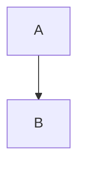

# Business Presentation Reference — Brand, Rendering & Slide Rules

Rules for Slidev rendering of business presentations. Shares the brand system with `docs-presentations-code` but adapts content budgets and slide types for decision-maker audiences.

---

## Design System

All CSS custom properties, typography scale, spacing tokens, component classes, and the complete `<style>` block live in a single file:

**→ [`templates/_design-system.md`](templates/_design-system.md)**

Include the design system's `<style>` block in the first `.md` file of every deck. Set `--footer-left` and `--footer-right` for your presenter and deck name.

### Quick Reference

| Category | Key Values |
|----------|-----------|
| **Typography** | Golden ratio scale: 4.236rem → 0.618rem (8 tiers) |
| **Spacing** | 8px base: 0.5rem → 4rem (6 tiers) |
| **Safe zone** | `48px 60px 68px 60px` on `.slidev-layout` |
| **Colors** | `--c-bg` #1A1A1A, `--c-text` #E8E4DD, `--c-gold` #D4A853 |
| **Fonts** | Inter (body), JetBrains Mono (numbers/code) |

---

## Slide Templates

Each slide type has its own template file with copy-paste Slidev code, sizing notes, and examples.

| # | Template | File | CSS Classes |
|---|----------|------|-------------|
| 01 | Title Card | [`01-title-card.md`](templates/01-title-card.md) | `.badge-row`, `.badge`, `.badge--primary` |
| 02 | Section Divider | [`02-section-divider.md`](templates/02-section-divider.md) | `.divider-slide`, `.divider-act`, `.divider-title`, `.divider-sub` |
| 03 | Text Slide | [`03-text-slide.md`](templates/03-text-slide.md) | Base markdown (h2, bullets, blockquote) |
| 04 | Metric Grid | [`04-metric-grid.md`](templates/04-metric-grid.md) | `.metric-grid`, `.metric-card`, `.metric-value`, `.metric-label` |
| 05 | Two-Column | [`05-two-column.md`](templates/05-two-column.md) | `.two-col`, `.card`, `.card-list` |
| 06 | Bar Chart | [`06-bar-chart.md`](templates/06-bar-chart.md) | `.bar-row`, `.bar-label`, `.bar-track`, `.bar-fill`, `.bar-value` |
| 07 | Scenario Cards | [`07-scenario-cards.md`](templates/07-scenario-cards.md) | `.scenario-row`, `.scenario-card`, `.scenario-card--primary` |
| 08 | Heatmap | [`08-heatmap.md`](templates/08-heatmap.md) | `.heatmap`, `.heatmap-cell--high/med/low` |
| 09 | Timeline | [`09-timeline.md`](templates/09-timeline.md) | `.timeline-container`, `.timeline-dot--active/future` |
| 10 | Decision Ask | [`10-decision-ask.md`](templates/10-decision-ask.md) | `.decision-item`, `.decision-number`, `.decision-title` |
| 11 | Data Table | [`11-data-table.md`](templates/11-data-table.md) | Base table styles + `font-size: var(--font-small)` wrapper |
| 12 | Mermaid Diagram | [`12-mermaid-diagram.md`](templates/12-mermaid-diagram.md) | `<Transform>` wrapper + 3-tier classDef |
| 13 | Center Pause | [`13-center-pause.md`](templates/13-center-pause.md) | `layout: center`, `.pause-context` |
| 14 | Closing Card | [`14-closing-card.md`](templates/14-closing-card.md) | `.closing-tagline`, `.closing-attribution` |

**Full example deck**: [`templates/00-example-deck.md`](templates/00-example-deck.md) — all templates in action with real data.

---

## Output Files

Every deck directory MUST contain ALL of these files:

### `package.json`

```json
{
  "name": "<presentation-name>",
  "private": true,
  "scripts": {
    "dev": "slidev",
    "build": "slidev build",
    "export": "slidev export"
  },
  "dependencies": {
    "@slidev/cli": "^52.11.4",
    "@slidev/theme-default": "latest"
  }
}
```

### `setup/mermaid.ts` — Mermaid dark theme config

```ts
import { defineMermaidSetup } from '@slidev/types'

export default defineMermaidSetup(() => ({
  theme: 'dark',
  themeVariables: {
    mainBkg: '#2A2A2A', nodeBorder: '#D4A853', clusterBkg: '#2A2A2A', clusterBorder: '#3A3A3A',
    primaryTextColor: '#E8E4DD', secondaryTextColor: '#C8C4BD', tertiaryTextColor: '#6B6B6B',
    lineColor: '#D4A853', primaryColor: '#3A3A3A', secondaryColor: '#2A2A2A', tertiaryColor: '#1A1A1A',
    actorBkg: '#2A2A2A', actorBorder: '#D4A853', actorTextColor: '#E8E4DD',
    signalColor: '#D4A853', signalTextColor: '#E8E4DD',
    noteBkgColor: '#3A3A3A', noteTextColor: '#E8E4DD', noteBorderColor: '#D4A853',
    classText: '#E8E4DD',
  },
  flowchart: { useMaxWidth: true },
  sequence: { useMaxWidth: true },
}))
```

---

## Brand & Styling

### Palette

| Token | Hex | Use |
|-------|-----|-----|
| `--c-bg` | `#1A1A1A` | Slide background |
| `--c-text` | `#E8E4DD` | Primary text, h1 |
| `--c-gold` | `#D4A853` | Accents, h2/h3, inline code, borders, key metrics |
| `--c-card` | `#2A2A2A` | Cards, table headers, blockquotes |
| `--c-code` | `#1E1E1E` | Code block background |
| `--c-border` | `#3A3A3A` | Borders, dividers |
| `--c-muted` | `#6B6B6B` | Captions, secondary text, labels |
| `--c-dim` | `#4A4A4A` | Footer text |
| `--c-sub` | `#C8C4BD` | Subtitles, supporting text |

### Typography

- **Headings**: Inter, system-ui, 700 weight
- **Body**: Inter, system-ui, 400 weight
- **Numbers / Monospace**: JetBrains Mono, Fira Code, monospace

### Headmatter

```yaml
---
theme: default
title: "Presentation Title"
info: "Subtitle"
author: "Presenter Name"
highlighter: shiki
transition: slide-left
canvasWidth: 1200
mdc: true
---
```

---

## Mermaid Rendering

### SVG Containment (handled by design system)

The design system `<style>` block includes Mermaid SVG containment rules. No additional CSS needed.

### `<Transform>` — All Diagrams

Use on ALL Mermaid diagrams:

````md
<Transform :scale="0.85" origin="top center">



</Transform>
````

**Never use** the Mermaid `scale` parameter — it's broken (Slidev issue #952).

### Sequence Diagram Containment

1. `zoom: 0.9` in slide frontmatter
2. `<Transform :scale="0.85" origin="top center">` wrapper
3. Max 4 participants, max 6 messages
4. Short participant aliases (3-4 chars)

---

## Diagram Rules

### Color Coding — Exactly 3 Tiers

| Tier | Style | Use |
|------|-------|-----|
| Primary | `fill:#D4A853,stroke:#B8912A,color:#1A1A1A` | Entry points, key focus |
| Secondary | `fill:#3A3A3A,stroke:#D4A853,color:#E8E4DD` | Core components |
| Tertiary | `fill:#2A2A2A,stroke:#4A4A4A,color:#E8E4DD` | Support / external |

### Legend (required below every color-coded diagram)

See [template 12](templates/12-mermaid-diagram.md) for the legend HTML.

### Decomposition

| Complexity | Strategy |
|-----------|----------|
| 1-7 nodes | Inline |
| 8-10 nodes | CSS auto-scales, `<Transform>` for positioning |
| 11+ nodes | Decompose into overview + drill-down slides |

### Diagram Type Rules

- `graph TD` for hierarchies/architectures
- `graph LR` for pipelines/data flows
- `sequenceDiagram` for process lifecycles
- Node labels: 1-4 words max
- Edge labels: 0-3 words
- Max 3 subgraphs per diagram

---

## Content Budget (Hard Limits)

Business presentation budgets are tighter than code presentations — decision-makers scan, they don't read.

| Element | Max Per Slide |
|---------|---------------|
| Bullet points | 3 |
| Words per bullet | 20 |
| Total words (non-chart) | 40 |
| Table rows | 5 |
| Table columns | 4 |
| Metric cards | 6 |
| Diagram nodes | 10 |
| Diagram edges | 12 |
| Bar chart items | 6 |

### Content Ratios (target)

| Type | Range |
|------|-------|
| Charts, layouts & visuals | 40-55% |
| Metrics/Grids/Tables | 15-25% |
| Text/Narrative | 10-20% |
| Dividers | 5-10% |

---

## HTML in Slidev — Vue Compilation Rules

Slidev compiles each slide as a Vue SFC. **Mixing markdown syntax inside HTML elements produces malformed Vue templates.**

### The Rule

**Never use markdown bullet lists (`- item`) inside HTML `<div>` elements.** Use explicit `<ul><li>` tags instead.

### Wrong

```html
<div class="card">
  <h3>Title</h3>

- **Bold** item one
- Item two
</div>
```

### Correct

```html
<div class="card">
  <h3>Title</h3>
  <ul>
    <li><strong>Bold</strong> item one</li>
    <li>Item two</li>
  </ul>
</div>
```

### When This Applies

- Any `<div>` containing bullet points (cards, two-col, grids)
- Any `<div>` containing numbered lists
- Inline `<code>` in markdown-inside-HTML must also use `<code>` tags

### When Markdown Is Safe

- Top-level slide content (not inside any HTML element)
- After a closing `</div>` at root level
- Inside markdown-only slides with no custom HTML containers

---

## Speaker Notes Format

Business presentations include speaker notes as presenter scripts. In Slidev, these go in HTML comment blocks.

```markdown
---

## Slide Title

[slide content]

<!--
"Opening line in quotes — what you actually say."

Context and emphasis guidance.

Transition: "And that brings us to..."
-->

---
```

### What goes in speaker notes:
- First-person delivery script with exact quoted phrases
- Pacing directives ("Pause here. Let this land.")
- Transition language to next slide

### What does NOT go in Slidev output:
- Preparation notes (data sources, citations)
- DO NOT SAY guidance
- Counterarguments and alternative framings
- Fallback plans

These belong in the source strategy document or section files — for rehearsal only, not in the rendered deck.

---

## Anti-Patterns

| Pattern | Fix |
|---------|-----|
| **Wall of text** (>3 bullets, >20 words each) | Split into two slides or use visual layout |
| **Markdown inside HTML divs** | Use explicit `<ul><li>` HTML tags |
| **Chart with no annotation** | Add takeaway quote or label the insight |
| **Bare Mermaid** (no Transform/legend) | `<Transform :scale="0.85">` + legend div |
| **Prep notes in output** | Omit — those stay in source files |
| **Too many metrics** (>6 cards) | Split across slides or prioritize top 6 |
| **Generic colors** | Use brand palette only — gold for emphasis, grey for supporting |
| **Inline styles for tokenized values** | Use CSS classes from the design system |

---

## Exporting

**WSL detection**: `grep -qi microsoft /proc/version 2>/dev/null`

- **Non-WSL**: `npm install && npm i -D playwright-chromium`, then `npx slidev export --output <name>.pdf --timeout 60000`
- **WSL/fallback**: `npm install`, start `npx slidev slides.md --port 3030 &`, tell user to open `http://localhost:3030/export`
