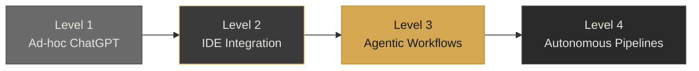

# Example Deck — AI-Augmented Engineering at CoreKinect

Full example deck rewritten using the design system CSS classes. Same content as the original example, restructured to use tokenized styles instead of inline CSS.

> This file is a formatting reference for Phase 3 rendering agents. Load alongside `_design-system.md` when generating slides.

---

## Headmatter

```yaml
---
theme: default
title: "AI-Augmented Engineering at CoreKinect"
info: "Internal proposal for AI tooling adoption"
author: "Mateo Segura"
highlighter: shiki
transition: slide-left
canvasWidth: 1200
mdc: true
---
```

## Style Block

Copy from `_design-system.md`, then set the footer variables:

```css
--footer-left: 'Mateo Segura · Jan 2026';
--footer-right: 'ai-engineering-proposal';
```

---

## Slide 1 — Title Card (template: 01)

```html
---

# AI-Augmented Engineering at CoreKinect

<div style="margin-top: var(--space-lg);">
  <p style="font-size: var(--font-subtitle); color: var(--c-sub); font-weight: 400;">
    What two months of AI-augmented development looks like in practice
  </p>
</div>

<div class="badge-row">
  <span class="badge badge--primary">Live Demos</span>
  <span class="badge">Internal Proposal</span>
  <span class="badge">Jan 2026</span>
</div>

<!--
"Let me show you what AI-augmented engineering looks like — not in theory, but in our codebase, with our tools."

No preamble. Go straight to the first demo.
-->
```

---

## Slide 2 — Text Slide (template: 03)

```markdown
---

## Demo 1: Concord Test Enhancement

- Feature built in **4 hours** — typical estimate was **2-3 weeks**
- Used Claude Code with custom Concord skills
- Full regression suite passing, merged to main

<!--
"This is a real feature, merged into our codebase. Four hours from prompt to passing tests. The previous estimate for this work was two to three weeks."

Pause. Let the contrast land before moving on.

Transition: "Let me show you something outside my domain."
-->
```

---

## Slide 3 — Bar Chart (template: 06)

```html
---

## Time Savings Summary

<div style="margin-top: var(--space-md);">
  <div class="bar-row">
    <span class="bar-label">Concord Enhancement</span>
    <div class="bar-track">
      <div class="bar-fill" style="width: 95%;"></div>
    </div>
    <span class="bar-value">4 hrs → 2 wks</span>
  </div>
  <div class="bar-row">
    <span class="bar-label">Cross-Domain Build</span>
    <div class="bar-track">
      <div class="bar-fill" style="width: 80%;"></div>
    </div>
    <span class="bar-value">6 hrs → 1 wk</span>
  </div>
  <div class="bar-row">
    <span class="bar-label">MCP Integration</span>
    <div class="bar-track">
      <div class="bar-fill" style="width: 70%;"></div>
    </div>
    <span class="bar-value">8 hrs → 2 wks</span>
  </div>
</div>

> "Hours instead of weeks — with production-quality output"

<!--
"Every bar represents real work in our codebase. Hours measured against the team's historical estimates for equivalent scope."

Transition: "Now let me show you why this isn't just about my workflow."
-->
```

---

## Slide 4 — Section Divider (template: 02)

```html
---

<div class="divider-slide">
  <div class="divider-act">The Landscape</div>
  <div class="divider-title">Where the Industry Is Going</div>
  <div class="divider-sub">Cost trends, capability growth, and the embedded gap</div>
</div>
```

---

## Slide 5 — Mermaid Diagram (template: 12)

````html
---

## AI Adoption Maturity

<Transform :scale="0.85" origin="top center">



</Transform>

<div class="mt-4 flex gap-4 justify-center text-xs">
  <div class="flex items-center gap-2">
    <div class="w-3 h-3 rounded" style="background: #6B6B6B;"></div>
    <span style="color: var(--c-sub);">We are here</span>
  </div>
  <div class="flex items-center gap-2">
    <div class="w-3 h-3 rounded" style="background: #D4A853;"></div>
    <span style="color: var(--c-sub);">Target (6-month horizon)</span>
  </div>
</div>

> "The gap between Level 1 and Level 3 is where the ROI lives"

<!--
"Most engineering teams are here — Level 1. Ad-hoc ChatGPT use, no methodology, no institutional knowledge capture."

Point to Level 3. "This is where the compounding starts. Custom skills, MCP servers, team-wide adoption."

Transition: "Let me show you what's happening to costs."
-->
````

---

## Slide 6 — Data Table (template: 11)

```html
---

## LLMflation — Cost Per Token

<div style="font-size: var(--font-small);">

| Date | Model | Cost / 1M tokens | Relative |
|------|-------|-------------------|----------|
| Mar 2023 | GPT-4 | $60.00 | 1x |
| Mar 2024 | Claude 3 Opus | $75.00 | 1.25x |
| Jun 2024 | Claude 3.5 Sonnet | $9.00 | 0.15x |
| Feb 2025 | Claude 3.5 Sonnet (repriced) | $3.00 | 0.05x |
| Oct 2025 | Claude 3.5 Haiku | $0.50 | 0.008x |

</div>

> "GPT-4-equivalent performance at 0.8% of the original price — in under 3 years"

<!--
"This is LLMflation. The same capability that cost $60 per million tokens in 2023 costs 50 cents today."

Pause. Point to the gap between first and last row.

"That's a 120x cost reduction. And the trajectory is accelerating."

Transition: "So the capability is real, the costs are falling. Where does this apply to our work?"
-->
```

---

## Slide 7 — Section Divider (template: 02)

```html
---

<div class="divider-slide">
  <div class="divider-act">The Opportunity</div>
  <div class="divider-title">Where It Applies to Us</div>
  <div class="divider-sub">Domain-by-domain before and after</div>
</div>
```

---

## Slide 8 — Two-Column (template: 05)

```html
---

## Testing (Concord) — Before and After

<div class="two-col">
  <div class="card">
    <h3>Before</h3>
    <ul class="card-list">
      <li>Manual test writing — 2-4 hours per test suite</li>
      <li>Copy-paste patterns across similar tests</li>
      <li>Test coverage gaps in complex edge cases</li>
    </ul>
  </div>
  <div class="card">
    <h3>After</h3>
    <ul class="card-list">
      <li>AI-generated test suites from specs — minutes</li>
      <li>Custom Concord skills enforce project patterns</li>
      <li>Edge cases suggested by AI analysis</li>
    </ul>
  </div>
</div>

<!--
"Testing is where the fastest wins are. Concord test generation is already working — you saw the demo."

Point to the 'After' column. "Custom skills mean the AI writes tests that follow OUR patterns, not generic ones."

Transition: "Let me show you the readiness across all domains."
-->
```

---

## Slide 9 — Heatmap (template: 08)

```html
---

## Domain Readiness

<div class="heatmap heatmap--2col">
  <div class="heatmap-corner"></div>
  <div class="heatmap-colhead">Out of Box</div>
  <div class="heatmap-colhead">With Custom Tooling</div>

  <div class="heatmap-rowhead">Testing (Concord)</div>
  <div class="heatmap-cell heatmap-cell--med">6/10</div>
  <div class="heatmap-cell heatmap-cell--high">9/10</div>

  <div class="heatmap-rowhead">Cloud + UI</div>
  <div class="heatmap-cell heatmap-cell--med">8/10</div>
  <div class="heatmap-cell heatmap-cell--high">9/10</div>

  <div class="heatmap-rowhead">Embedded + FW</div>
  <div class="heatmap-cell heatmap-cell--low">3/10</div>
  <div class="heatmap-cell heatmap-cell--med">7/10</div>
</div>

> "The gap between columns is where custom tooling creates the biggest ROI"

<!--
"The biggest gaps are in embedded and testing. That's where custom MCP servers and skills unlock the most value."

Point to the right column. "These scores are achievable — some are already built."

Transition: "Now let's look at the numbers."
-->
```

---

## Slide 10 — Section Divider (template: 02)

```html
---

<div class="divider-slide">
  <div class="divider-act">The Math</div>
  <div class="divider-title">ROI and Investment</div>
  <div class="divider-sub">Transparent assumptions, conservative scenarios</div>
</div>
```

---

## Slide 11 — Data Table (template: 11)

```html
---

## Assumptions — On the Table

<div style="font-size: var(--font-small);">

| Assumption | Value | Source |
|------------|-------|--------|
| Engineering team | 15 engineers | Current headcount |
| Avg. loaded cost | $160K/year | Industry benchmark (IoT, mid-level) |
| Tooling cost | $150/user/month | Claude Team Premium published pricing |
| Annual tooling investment | $27,000 | 15 × $150 × 12 |

</div>

> "Every number has a source. Every calculation is reproducible."

<!--
"Before I show you the ROI, I want you to see every assumption I'm making. Nothing hidden."

Walk through each row briefly. Emphasize that $27K is the total annual cost.

Transition: "Here's what the math looks like across three scenarios."
-->
```

---

## Slide 12 — Scenario Cards (template: 07)

```html
---

## ROI — Three Scenarios

<div class="scenario-row">
  <div class="scenario-card scenario-card--primary">
    <div class="scenario-label">Conservative</div>
    <div class="scenario-value">$453K</div>
    <div class="scenario-detail">20% productivity gain</div>
    <div class="scenario-sub">1,678% ROI</div>
  </div>
  <div class="scenario-card">
    <div class="scenario-label">Moderate</div>
    <div class="scenario-value">$813K</div>
    <div class="scenario-detail">35% productivity gain</div>
    <div class="scenario-sub">3,011% ROI</div>
  </div>
  <div class="scenario-card">
    <div class="scenario-label">Aggressive</div>
    <div class="scenario-value">$1.17M</div>
    <div class="scenario-detail">50% productivity gain</div>
    <div class="scenario-sub">4,344% ROI</div>
  </div>
</div>

> "$27K investment — conservative return is $453K"

<!--
"I'm leading with the conservative number: $453K. That's a 20% productivity gain, which is below what the published studies show."

Point to the conservative card. "This is the number I'm asking you to evaluate against the $27K investment."

"The moderate and aggressive scenarios are ceilings, not promises."

Transition: "Now let me address the question I know you're thinking about — security and data privacy."
-->
```

---

## Slide 13 — Section Divider (template: 02)

```html
---

<div class="divider-slide">
  <div class="divider-act">The Ask</div>
  <div class="divider-title">Two Decisions</div>
  <div class="divider-sub">One today, one as a follow-up</div>
</div>
```

---

## Slide 14 — Decision Ask (template: 10)

```html
---

## Two Decisions

<div class="decision-item">
  <span class="decision-number">1.</span>
  <div>
    <div class="decision-title">Approve team AI tooling</div>
    <div class="decision-desc">$27K/year for Claude Code access — 15 engineers</div>
  </div>
</div>

<div class="decision-item">
  <span class="decision-number">2.</span>
  <div>
    <div class="decision-title">Greenlight role proposal</div>
    <div class="decision-desc">Detailed comp package delivered in a follow-up meeting</div>
  </div>
</div>

> "$27K investment against $453K in conservative returns — led by someone who's already proven it works"

<!--
"I'm asking for two things today." Hold up two fingers.

"First, the tooling investment — $27K. That should be a straightforward yes given the ROI we just walked through."

Pause.

"Second, a green light to formalize the role proposal. I'll put together the full comp details for a follow-up conversation."

"Can we schedule the follow-up within two weeks?"
-->
```

---

## Slide 15 — Timeline (template: 09)

```html
---

## Next Steps

<div class="timeline-container">
  <div class="timeline-line"></div>
  <div class="timeline-phases">
    <div class="timeline-phase">
      <div class="timeline-dot timeline-dot--active"></div>
      <div class="timeline-phase-title">Weeks 1-2</div>
      <div class="timeline-phase-date">Team plan provisioned</div>
      <div class="timeline-phase-desc">CLAUDE.md deployed to all repos</div>
    </div>
    <div class="timeline-phase">
      <div class="timeline-dot timeline-dot--future"></div>
      <div class="timeline-phase-title">Weeks 3-4</div>
      <div class="timeline-phase-date">First training sessions</div>
      <div class="timeline-phase-desc">Initial MCP servers deployed</div>
    </div>
    <div class="timeline-phase">
      <div class="timeline-dot timeline-dot--future"></div>
      <div class="timeline-phase-title">Months 2-3</div>
      <div class="timeline-phase-date">Domain-specific adoption</div>
      <div class="timeline-phase-desc">Velocity measurement begins</div>
    </div>
  </div>
</div>

<!--
"Here's the timeline. If we approve tooling today, the team can be productive within a month."

Walk through each milestone briefly. Don't linger.

"Can we get a decision on the tooling by end of week?"
-->
```

---

## Slide 16 — Closing Card (template: 14)

```html
---

# AI-Augmented Engineering at CoreKinect

<div class="closing-tagline">
  $27K investment · $453K conservative return · 15 engineers · Proven methodology
</div>

<div class="closing-attribution">
  Generated with Claude Code
</div>
```
