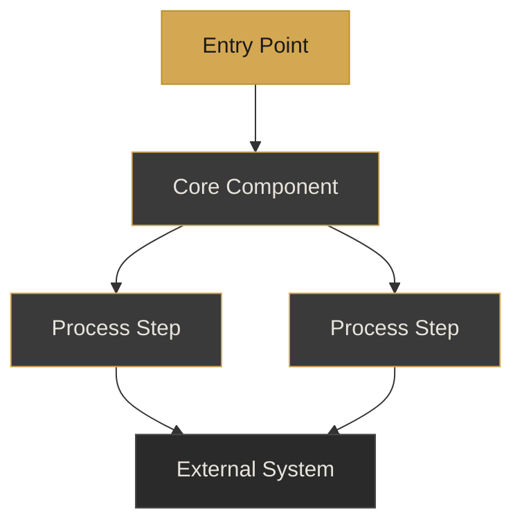
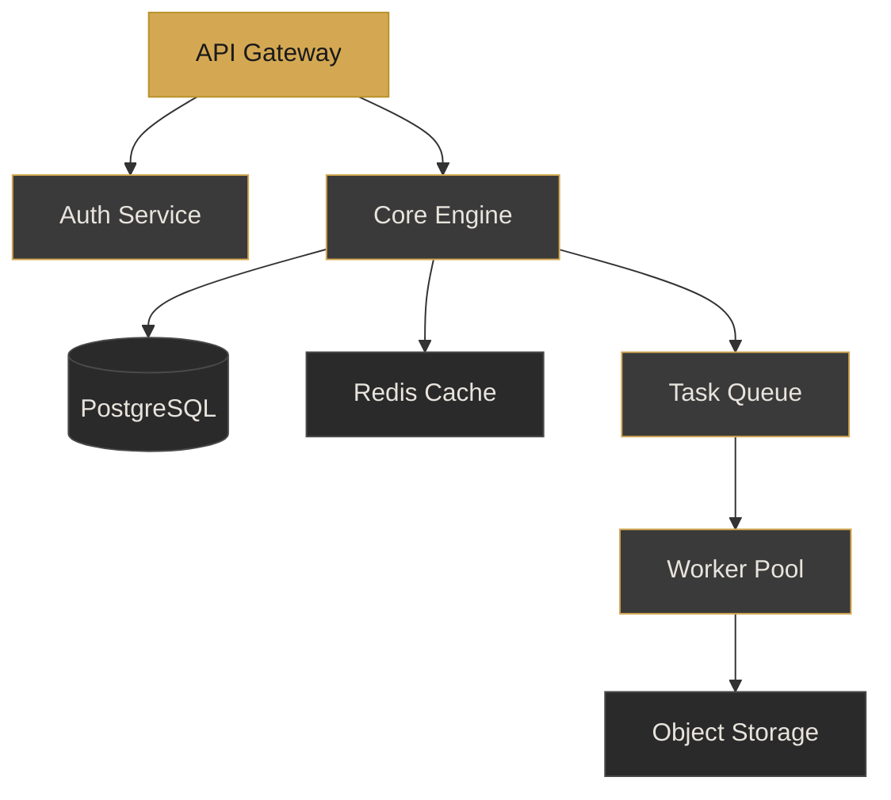

# Mermaid Diagram
> Use for architecture overviews, data flow pipelines, process lifecycles, or system hierarchies. Requires the `<Transform>` wrapper, dark theme, 3-tier color coding, and a legend.

## Design Tokens Used

| Token | Value | Purpose |
|-------|-------|---------|
| `--font-h2` | 1.618rem | Slide title (h2, gold) |
| `--c-gold` | #D4A853 | Primary node fill, stroke on secondary nodes, legend swatch |
| `--c-gold-dim` | #B8912A | Primary node stroke |
| `--c-bg` | #1A1A1A | Primary node text, edge label background |
| `--c-text` | #E8E4DD | Secondary/tertiary node text, edge label text |
| `--c-card` | #2A2A2A | Tertiary node fill |
| `--c-border` | #3A3A3A | Secondary node fill, tertiary node stroke |
| `--c-dim` | #4A4A4A | Tertiary node stroke |
| `--c-sub` | #C8C4BD | Legend label text |

## Template

````html
---

## Slide Title

<Transform :scale="0.85" origin="top center">



</Transform>

<div class="mt-4 flex gap-4 justify-center text-xs">
  <div class="flex items-center gap-2">
    <div class="w-3 h-3 rounded" style="background: #D4A853;"></div>
    <span style="color: #C8C4BD;">Primary label</span>
  </div>
  <div class="flex items-center gap-2">
    <div class="w-3 h-3 rounded border" style="background: #3A3A3A; border-color: #D4A853;"></div>
    <span style="color: #C8C4BD;">Core label</span>
  </div>
  <div class="flex items-center gap-2">
    <div class="w-3 h-3 rounded border" style="background: #2A2A2A; border-color: #4A4A4A;"></div>
    <span style="color: #C8C4BD;">External label</span>
  </div>
</div>

<!--
"Here's how the pieces fit together."

Walk through the diagram top-to-bottom or left-to-right.
Name each tier: entry point, core processing, external dependencies.

Transition: "Now let's look at the timeline for building this..."
-->
````

### Classes Used

| Class / Element | Purpose |
|-----------------|---------|
| `<Transform :scale="0.85" origin="top center">` | Required Slidev wrapper — scales the Mermaid SVG to fit the safe zone. Never use Mermaid's native `scale` parameter (broken per Slidev issue #952) |
| `classDef primary` | Gold fill, dark text — entry points and key focus nodes |
| `classDef secondary` | Dark fill with gold stroke — core system components |
| `classDef tertiary` | Darker fill with dim stroke — support or external systems |
| Legend `<div>` | Required below every color-coded diagram — three swatches with labels |

## Sizing Notes

- **Nodes**: Maximum 10 nodes per diagram. At 11+ nodes, decompose into an overview slide plus drill-down slides.
- **Edges**: Maximum 12 edges. More connections make the diagram unreadable at presentation scale.
- **Subgraphs**: Maximum 3 subgraphs. Each subgraph label renders in gold via the `.mermaid .cluster text` base style.
- **Node labels**: 1-4 words maximum. Use noun phrases, not sentences.
- **Edge labels**: 0-3 words. Use only when the relationship is non-obvious. Add via `-->|label|` syntax.
- **Diagram type selection**:
  - `graph TD` for hierarchies and architectures (top-down)
  - `graph LR` for pipelines and data flows (left-right)
  - `sequenceDiagram` for process lifecycles (add `zoom: 0.9` in frontmatter, max 4 participants, max 6 messages)
- **Legend labels**: Customize the three legend labels to match your diagram's domain (e.g., "Entry Point", "Services", "External APIs"). Always keep exactly three tiers.
- **SVG containment**: The design system caps Mermaid SVGs at `max-width: 95%` and `max-height: 440px`. The `<Transform>` wrapper provides additional scaling headroom.
- **Complexity threshold**: 1-7 nodes render cleanly inline. 8-10 nodes still fit with the `<Transform>` wrapper. Above 10, always split.

## Example

````html
---

## Platform Architecture

<Transform :scale="0.85" origin="top center">



</Transform>

<div class="mt-4 flex gap-4 justify-center text-xs">
  <div class="flex items-center gap-2">
    <div class="w-3 h-3 rounded" style="background: #D4A853;"></div>
    <span style="color: #C8C4BD;">Entry point</span>
  </div>
  <div class="flex items-center gap-2">
    <div class="w-3 h-3 rounded border" style="background: #3A3A3A; border-color: #D4A853;"></div>
    <span style="color: #C8C4BD;">Platform services</span>
  </div>
  <div class="flex items-center gap-2">
    <div class="w-3 h-3 rounded border" style="background: #2A2A2A; border-color: #4A4A4A;"></div>
    <span style="color: #C8C4BD;">Infrastructure</span>
  </div>
</div>

<!--
"This is the target architecture — seven components across three tiers."

Start at the API Gateway. Trace the request path down to storage.
Emphasize that the worker pool is the key scaling lever.

Transition: "Let me show you what this costs to operate..."
-->
````
