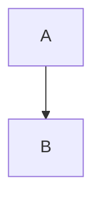

# Presentation Reference — Brand, Rendering & Slide Rules

This file contains all rendering, styling, and content rules for generated Slidev presentations. Loaded by generation agents during Phase 3.

---

## Output Files

Every deck directory MUST contain ALL of these files:

### `package.json`

```json
{
  "name": "<codebase-name>-presentation",
  "private": true,
  "scripts": {
    "dev": "slidev",
    "build": "slidev build",
    "export": "slidev export"
  },
  "dependencies": {
    "@slidev/cli": "^52.11.4",
    "@slidev/theme-default": "latest"
  }
}
```

### `setup/mermaid.ts` — Mermaid dark theme config

```ts
import { defineMermaidSetup } from '@slidev/types'

export default defineMermaidSetup(() => ({
  theme: 'dark',
  themeVariables: {
    mainBkg: '#2A2A2A', nodeBorder: '#D4A853', clusterBkg: '#2A2A2A', clusterBorder: '#3A3A3A',
    primaryTextColor: '#E8E4DD', secondaryTextColor: '#C8C4BD', tertiaryTextColor: '#6B6B6B',
    lineColor: '#D4A853', primaryColor: '#3A3A3A', secondaryColor: '#2A2A2A', tertiaryColor: '#1A1A1A',
    actorBkg: '#2A2A2A', actorBorder: '#D4A853', actorTextColor: '#E8E4DD',
    signalColor: '#D4A853', signalTextColor: '#E8E4DD',
    noteBkgColor: '#3A3A3A', noteTextColor: '#E8E4DD', noteBorderColor: '#D4A853',
    classText: '#E8E4DD',
  },
  flowchart: { useMaxWidth: true },
  sequence: { useMaxWidth: true },
}))
```

---

## Brand & Styling

### Palette

| Token | Hex | Use |
|-------|-----|-----|
| Background | `#1A1A1A` | Slide background |
| Text | `#E8E4DD` | Primary text, h1 |
| Gold | `#D4A853` | Accents, h2/h3, inline code, borders |
| Card BG | `#2A2A2A` | Cards, table headers, blockquotes |
| Code BG | `#1E1E1E` | Code block background (VS Code Dark+) |
| Grey Mid | `#3A3A3A` | Borders, dividers |
| Grey Muted | `#6B6B6B` | Captions, secondary text |
| Grey Dim | `#4A4A4A` | Footer text |

### Typography

- **Headings**: Inter, system-ui, 700 weight
- **Body**: Inter, system-ui, 400 weight
- **Code**: JetBrains Mono, Fira Code, monospace

### Persistent Footer

```css
:root {
  --footer-left: 'Mateo Segura · Jan 2026';
  --footer-right: 'codebase-name-v0.1.0';
}
.slidev-layout::before {
  content: var(--footer-left);
  position: fixed; bottom: 1em; left: 2em;
  font-size: 0.65em; color: #4A4A4A; font-family: 'Inter', system-ui;
  letter-spacing: 0.02em; z-index: 100;
}
.slidev-layout::after {
  content: var(--footer-right);
  position: fixed; bottom: 1em; right: 2em;
  font-size: 0.65em; color: #4A4A4A; font-family: 'JetBrains Mono', monospace;
  z-index: 100;
}
```

### Code Blocks — VS Code Dark+ Theme

```css
pre {
  background: #1E1E1E !important;
  border: 1px solid #333333 !important;
  border-radius: 6px !important;
  font-family: 'JetBrains Mono', 'Fira Code', monospace !important;
  font-size: 0.82em !important;
  padding: 1.2em !important;
  box-shadow: 0 4px 6px rgba(0, 0, 0, 0.4) !important;
}

.shiki-container {
  background: #1E1E1E !important;
  border: 1px solid #333333 !important;
  border-radius: 6px !important;
}

.shiki .line.highlighted {
  background: rgba(212, 168, 83, 0.12) !important;
  border-left: 3px solid #D4A853 !important;
  padding-left: 0.8em !important;
}

.shiki .line::before { color: #4A4A4A !important; }
```

### Headmatter

```yaml
---
theme: default
title: "Project Title"
info: "Subtitle"
author: "Mateo Segura"
highlighter: shiki
transition: slide-left
canvasWidth: 1200
mdc: true
---
```

---

## Mermaid Rendering

### SVG Containment (Required in every deck's global style)

```css
.mermaid {
  overflow: visible !important;
  display: flex;
  justify-content: center;
  background: transparent !important;
}
.mermaid svg {
  max-width: 95% !important;
  max-height: 440px !important;
  height: auto !important;
}
.mermaid .cluster text { fill: #D4A853; }
.mermaid .edgeLabel { background-color: #1A1A1A; color: #E8E4DD; }
```

**Why 440px?** With `canvasWidth: 1200` and 16:9, slide height is ~675px. 440px leaves room for title, legend, margins, footer.

**Never use** the Mermaid `scale` parameter — it's broken (Slidev issue #952).

### Sequence Diagram Containment

Sequence diagrams are taller than flowcharts. Required treatment:

1. `zoom: 0.9` in slide frontmatter
2. `<Transform :scale="0.85" origin="top center">` wrapper
3. Max 4 participants, max 6 messages
4. Short participant aliases (3-4 chars)

### `<Transform>` — All Diagrams

Use on ALL Mermaid diagrams:

````md
<Transform :scale="0.85" origin="top center">



</Transform>
````

---

## Diagram Rules

### Color Coding — Exactly 3 Tiers

| Tier | Style | Use |
|------|-------|-----|
| Primary | `fill:#D4A853,stroke:#B8912A,color:#1A1A1A` | Entry points, current focus |
| Secondary | `fill:#3A3A3A,stroke:#D4A853,color:#E8E4DD` | Core components |
| Tertiary | `fill:#2A2A2A,stroke:#4A4A4A,color:#E8E4DD` | Support / external |

### Legend (required below every color-coded diagram)

```html
<div class="mt-4 flex gap-4 justify-center text-xs">
  <div class="flex items-center gap-2">
    <div class="w-3 h-3 rounded" style="background: #D4A853;"></div>
    <span style="color: #C8C4BD;">Entry point</span>
  </div>
  <div class="flex items-center gap-2">
    <div class="w-3 h-3 rounded border" style="background: #3A3A3A; border-color: #D4A853;"></div>
    <span style="color: #C8C4BD;">Core module</span>
  </div>
  <div class="flex items-center gap-2">
    <div class="w-3 h-3 rounded border" style="background: #2A2A2A; border-color: #4A4A4A;"></div>
    <span style="color: #C8C4BD;">Support / external</span>
  </div>
</div>
```

### Decomposition

| Complexity | Strategy |
|-----------|----------|
| 1-7 nodes | Inline |
| 8-12 nodes | CSS auto-scales, `<Transform>` for positioning |
| 13+ nodes | Decompose into overview + drill-down slides |

### Diagram Type Rules

- `graph TD` for hierarchies/architectures
- `graph LR` for pipelines/data flows
- `sequenceDiagram` for request lifecycles
- Node labels: 1-4 words max
- Edge labels: 0-3 words
- Max 4 subgraphs per diagram
- Sequence diagrams: max 4 participants, max 6 messages

---

## The Five Acts

Each deck follows this structure. The depth (lighter vs full) adjusts slide counts.

| Act | Name | Question | Full | Lighter |
|-----|------|----------|------|---------|
| 1 | **ORIENT** | "What is this and why should I care?" | 2-3 | 2 |
| 2 | **MAP** | "How does it fit into my system?" | 4-6 | 2-3 |
| 3 | **SCENARIOS** | "When would I use this in the real world?" | 5-8 | 3-4 |
| 4 | **PROVE** | "Can I trust it? How do I get started?" | 2-4 | 1-2 |
| 5 | **LAND** | "What do I take away?" | 2-3 | 1-2 |

**Full deck**: 15-24 slides. **Lighter deck**: 12-16 slides.

### Act 1: ORIENT

- **Title Card**: Project name, one-line description (max 12 words), version, language badge
- **Vital Signs**: 4-6 metrics in a grid (LOC, test LOC, deps, files)
- **Problem-Solution** (optional): Two-column "Without" / "With" contrast

### Act 2: MAP

- **System Context Diagram**: Where does this sit? Caller → Library → External systems. 3-7 nodes.
- **Integration Boundaries**: What goes in, what comes out. Boundary diagram. Max 10 nodes.
- **Data Flow**: Sequence diagram from caller's perspective. Max 4 participants, 6 messages. Use `<Transform>` + `zoom: 0.9`.

### Act 3: SCENARIOS

- **Scenario Slides** (2-4): One per use case. Assertion headline + context + integration sketch diagram.
- **Decision Tree** (optional): When to choose this over alternatives. 5-7 nodes.
- **API Surface**: Table — Capability | What It Does | When You'd Use It. Max 8-10 entries.
- **Quick Start**: Minimum viable integration. Max 10 lines code. ONLY code slide in this act.

### Act 4: PROVE

- **Trust Signals**: Test coverage ratio, dep count, release history. Metric-grid layout.
- **Escape Hatches** (optional): Error categories + recovery strategies as table.
- **Project Map**: Area | Purpose | Size. Major modules only.

### Act 5: LAND

- **Metrics Dashboard**: 4-6 metrics. Reuse 1-2 from Vital Signs (bookend).
- **Closing Card**: Project name, repo URL, version, license. "Generated with Claude Code."

### Section Dividers

Use between each act (3-4 total). Centered layout, act name in uppercase, section title in large text.

---

## Content Budget (Hard Limits)

| Element | Max Per Slide |
|---------|---------------|
| Bullet points | 4 |
| Words per bullet | 10 |
| Total words (non-code) | 40 |
| Code lines | 10 |
| Highlighted lines | 3 |
| Diagram nodes | 12 |
| Diagram edges | 14 |
| Table rows | 10 |
| Table columns | 4 |
| Metric cards | 6 |
| **Code slides per deck** | **2** |

### Content Ratios

| Type | Range |
|------|-------|
| Diagrams & Scenarios | 35-50% |
| Metrics/Grids/Tables | 15-25% |
| Text/Narrative | 10-20% |
| Code | 5-10% (max 2 slides) |
| Dividers | 10-15% |

---

## Code Rules

**Code is supplementary, not central.** Max 2 code slides per deck. Max 10 lines per block. Only show the caller's perspective.

### When NOT to Show Code

- Type signatures → plain English on API Surface slide
- Error types → table on Escape Hatches slide
- Internal functions → never
- Test code → mention coverage %, don't show tests
- Config/options → capability table, not a struct

---

## Ordering Rules

1. Purpose before mechanism
2. Outside-in (caller → integration boundaries → never internals)
3. General before specific
4. Simple before complex
5. Diagram before code (always)
6. Scenario before API surface (why before what)
7. Happy path before error path
8. No forward references

---

## HTML in Slidev — Vue Compilation Rules

Slidev compiles each slide as a Vue SFC. **Mixing markdown syntax inside HTML elements produces malformed Vue templates.**

### The Rule

**Never use markdown bullet lists (`- item`) inside HTML `<div>` elements.** The markdown-to-HTML conversion creates `<li>` elements that aren't properly closed before the parent `</div>`, causing Vue compilation errors like `Element is missing end tag`.

### Wrong

```html
<div class="card">
  <h3>Title</h3>

- **Bold** item one
- Item two
</div>
```

### Correct

```html
<div class="card">
  <h3>Title</h3>
  <ul>
    <li><strong>Bold</strong> item one</li>
    <li>Item two</li>
  </ul>
</div>
```

### When This Applies

- Any `<div>` containing bullet points (cards, two-col, grids)
- Any `<div>` containing numbered lists
- Inline `<code>` in markdown-inside-HTML must also use `<code>` tags

### When Markdown Is Safe

- Top-level slide content (not inside any HTML element)
- After a closing `</div>` at root level
- Inside markdown-only slides with no custom HTML containers

---

## Anti-Patterns

| Pattern | Fix |
|---------|-----|
| **Wall of Code** (>10 lines, >2 slides) | Diagram or plain English |
| **Org Chart** (>12 nodes) | Zoom levels |
| **Implementation Tour** | Cut — show integration only |
| **Code Review Deck** (3+ code slides) | Scenario diagrams + capability tables |
| **No Use Cases** | Add SCENARIOS act |
| **Bare Sequence** (no Transform/zoom) | `<Transform :scale="0.85">` + `zoom: 0.9` |
| **Markdown inside HTML divs** | Use explicit `<ul><li>` HTML tags instead |

---

## Exporting

**WSL detection**: `grep -qi microsoft /proc/version 2>/dev/null`

- **Non-WSL**: `npm install && npm i -D playwright-chromium`, then `npx slidev export --output <name>.pdf --timeout 60000`
- **WSL/fallback**: `npm install`, start `npx slidev slides.md --port 3030 &`, tell user to open `http://localhost:3030/export`
